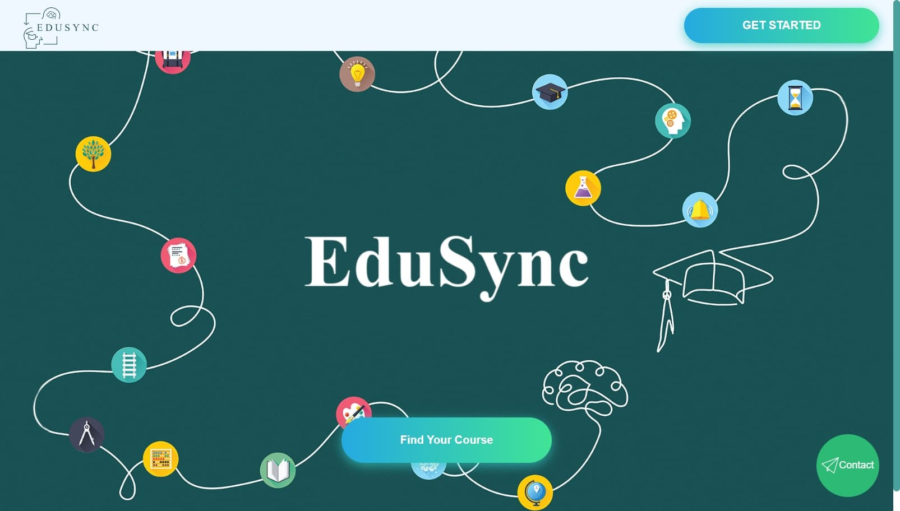
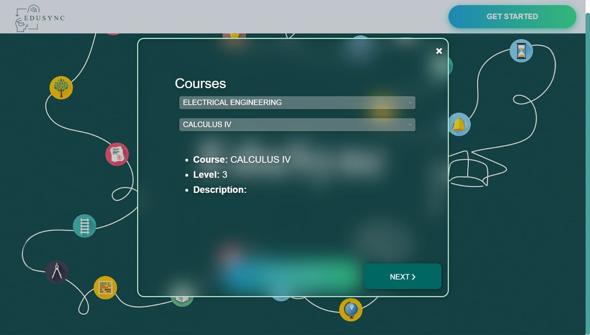
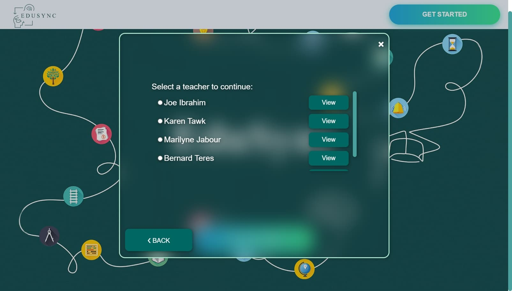
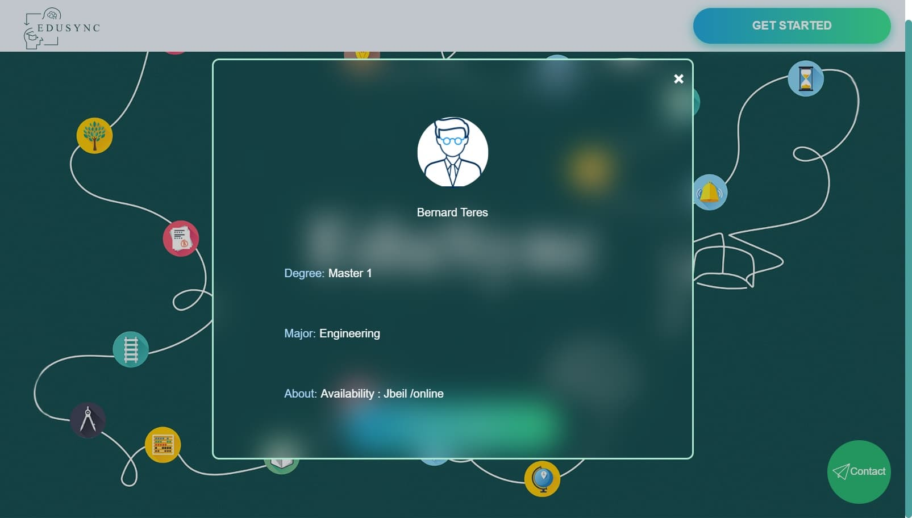
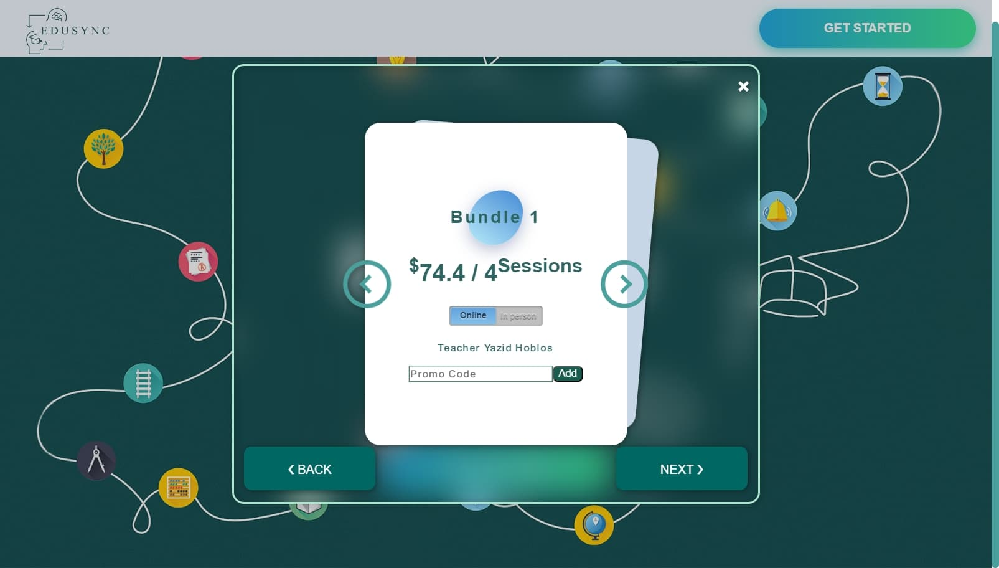
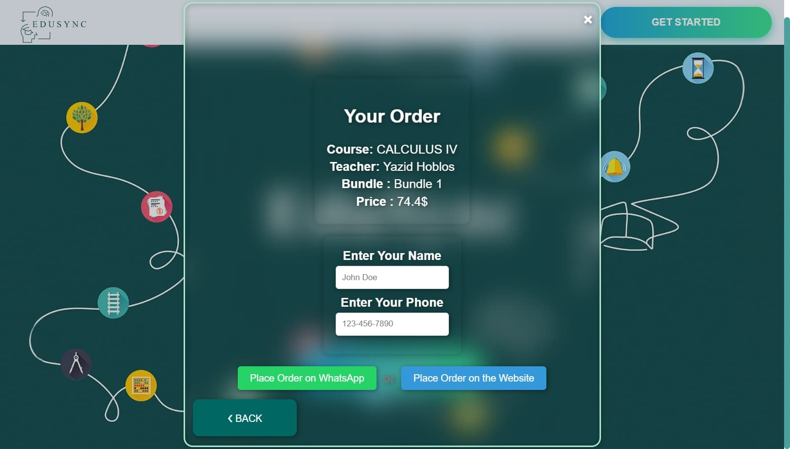
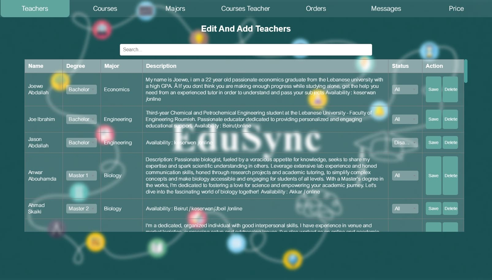
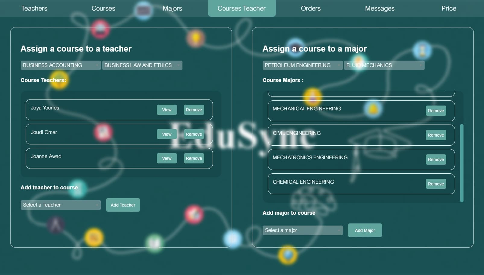

# 🌟 EduSync

EduSync is a dynamic **single-page application** that makes it easy to explore, select, and order courses across various majors. Designed with simplicity and flexibility in mind, EduSync allows users to place orders via **WhatsApp** or directly on the **website**, while providing a comprehensive admin panel for seamless platform management.

---

## 📚 Table of Contents

- [✨ Features](#-features)
- [📸 Screenshots](#-screenshots)
- [🚀 Usage](#-usage)
- [🛠️ Admin Features](#️-admin-features)
- [🤝 Contributing](#-contributing)
- [📜 License](#-license)

---

## ✨ Features

- 🌐 **Single Page Application**: Smooth and interactive navigation for exploring majors, courses, bundles, and locations.
- 💬 **Flexible Ordering**:
  - Order via **WhatsApp** with one click.
  - Place orders directly through the **website**.
- 📞 **Contact Page**: Easily get in touch for support or inquiries.
- 🔒 **Admin Panel**:
  - **Secure Authentication**: Role-based access to administrative features.
  - **Complete Management Tools**:
    - 🧑‍🏫 Teachers
    - 📖 Courses
    - 💰 Pricing
    - 🧑‍🏫 Teacher Assignments for Courses
    - 🎓 Majors within Courses

---

## 📸 Screenshots

Take a look at EduSync in action:

| **Homepage**              | **Course selection Page**            | **Teacher selection Page**             |
|---------------------------|----------------------------|----------------------------|
|  |  |  |

| **Teacher Preview**       | **bundle selection**     | **order preview**      |
|---------------------------|----------------------------|----------------------------|
|  |  |  |

| **messaging page**       | **Teacher management**     | **Course teacher assignment**      |
|---------------------------|----------------------------|----------------------------|
|  |  |  |

---

## 🚀 Usage

1. **Browse the platform**:
   - Choose your desired major, courses, and bundles.
   - Filter by **location** to find courses nearby.
2. **Place your order**:
   - 💬 **WhatsApp**: Click the button to order via WhatsApp.
   - 🛒 **Website**: Use the on-site form to complete your order.

---

## 🛠️ Admin Features

The **Admin Panel** empowers administrators with robust management tools:

- 🔒 **Authentication**:
  - Login and secure access for admins.
- 📊 **CRUD Operations**:
  - 🧑‍🏫 **Teachers**: Add, update, or delete teacher profiles.
  - 📖 **Courses**: Create, modify, or remove courses.
  - 💰 **Pricing**: Manage course and bundle prices.
  - 🧑‍🏫 **Teacher Assignments**: Assign teachers to specific courses.
  - 🎓 **Majors**: Organize and update majors within courses.

---

## 🤝 Contributing

We welcome contributions! To contribute:

1. **Fork the repository**.
2. Create a new branch for your feature:
   ```bash
   git checkout -b feature-name
   ```
3. Commit your changes:
   ```bash
   git commit -m "Add feature-name"
   ```
4. Push your branch:
   ```bash
   git push origin feature-name
   ```
5. Submit a **Pull Request** with a description of your changes.

---

## 📜 License

This project is licensed under the **Creative Commons Attribution-NonCommercial 4.0 International License**.  

### You are free to:
- **Share**: Copy and redistribute the material in any medium or format.
- **Adapt**: Remix, transform, and build upon the material.

### Under the following terms:
- **Attribution**: Give proper credit, provide a link to the license, and indicate if changes were made.
- **NonCommercial**: Do not use the material for commercial purposes.

For more details, visit the [license description](https://creativecommons.org/licenses/by-nc/4.0/).

---
